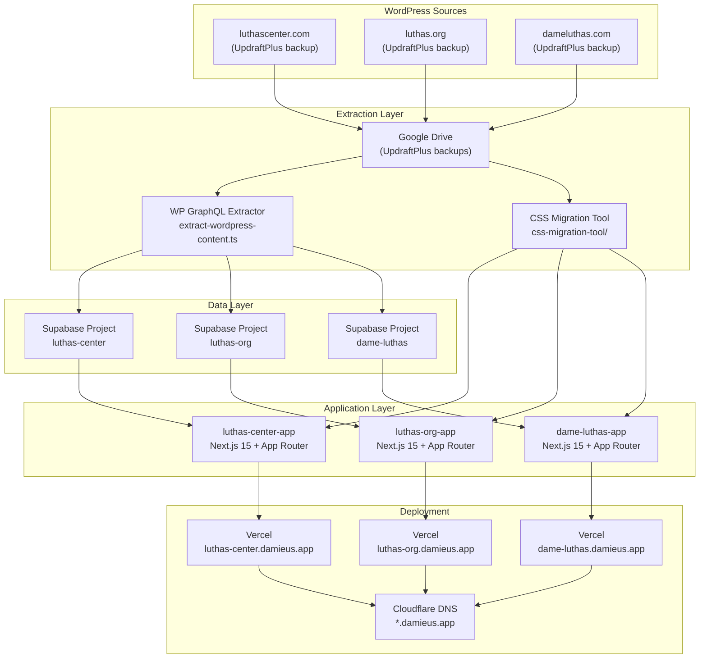
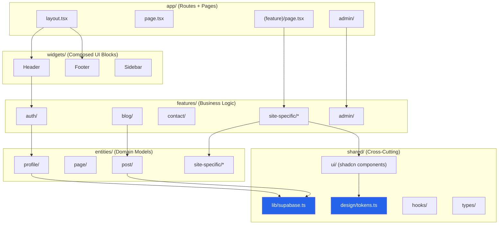
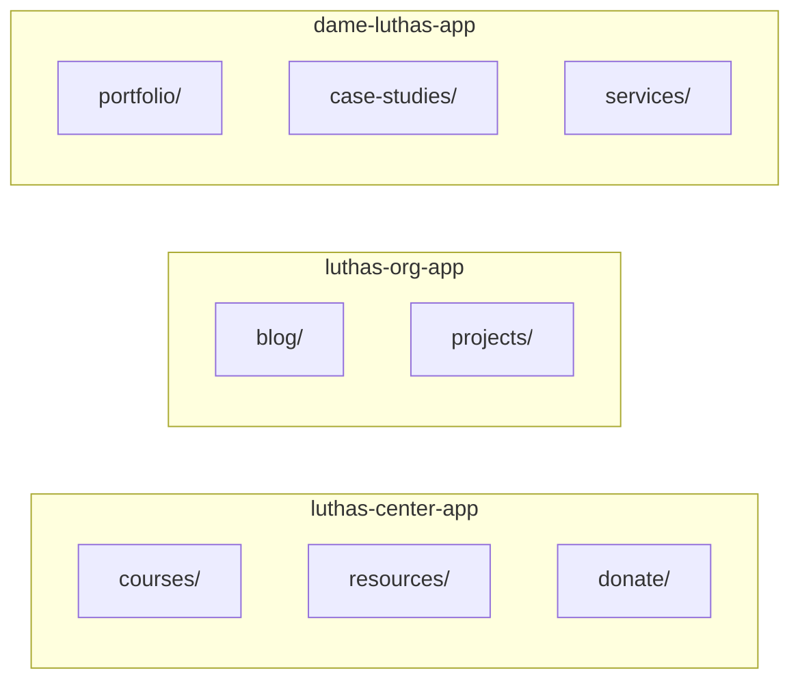
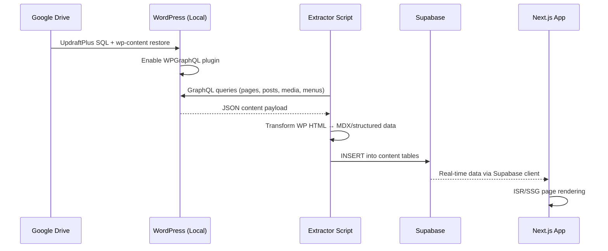
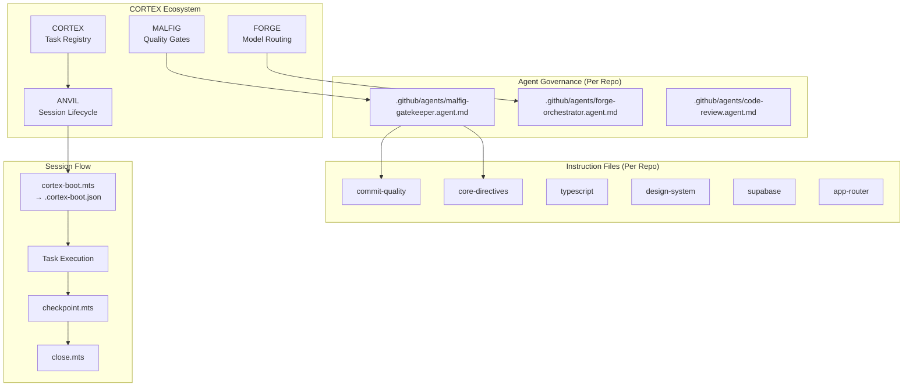
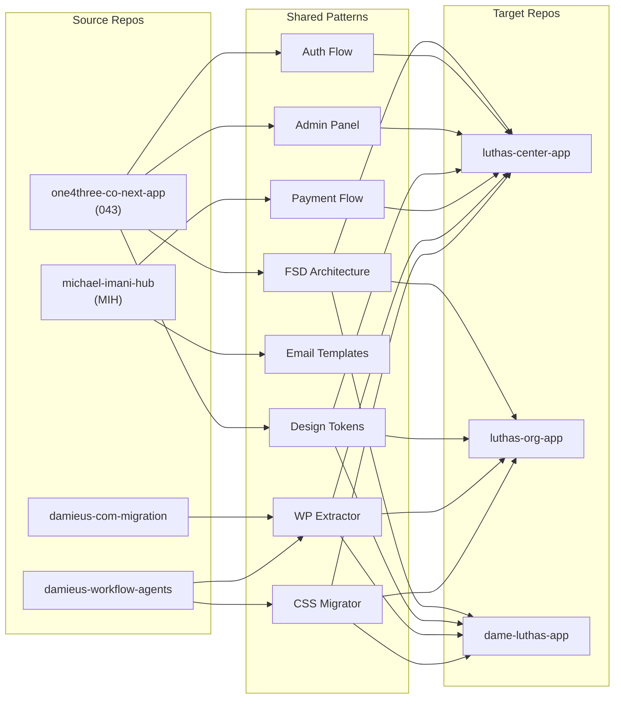
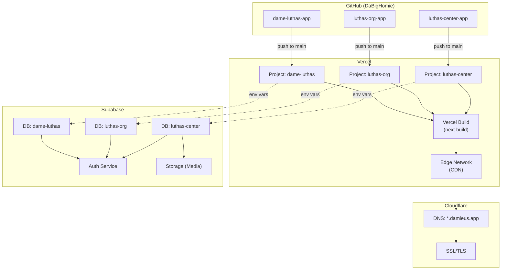

# Luthas WP → React Migration — Architecture & Walkthrough

> **Agent Reference**: This document is the single source of truth for the WordPress-to-React migration across all three Luthas sites.
> **CORTEX Key**: `artifact:sess_luthas:walkthrough`
> **Session**: `sess_luthas_wp_react_20260607`
> **Last Updated**: 2026-06-07

---

## Sites Overview

| Site | WordPress Source | React Repo | Dev Domain | Type |
|------|-----------------|------------|------------|------|
| Luthas Center for Excellence | luthascenter.com | `luthas-center-app` | luthas-center.damieus.app | LMS + Nonprofit |
| Luthas.Org | luthas.org | `luthas-org-app` | luthas-org.damieus.app | Content/Blog |
| Dame Luthas | dameluthas.com | `dame-luthas-app` | dame-luthas.damieus.app | Portfolio |

---

## System Architecture

---

## Migration Workflow

```mermaid
flowchart LR
    subgraph "Phase 0: Planning"
        P0A["CORTEX Tasks<br/>Registered"] --> P0B["Repos Created<br/>on GitHub"]
        P0B --> P0C["Next.js 15<br/>Scaffolded"]
        P0C --> P0D["FSD Structure<br/>+ Agent Files"]
    end

    subgraph "Phase 1: Extraction"
        P1A["Google Drive MCP<br/>Locate Backups"] --> P1B["Restore WP<br/>Locally"]
        P1B --> P1C["GraphQL<br/>Extract Content"]
        P1C --> P1D["CSS Migration<br/>Extract Tokens"]
    end

    subgraph "Phase 2: Schema"
        P2A["Design Supabase<br/>Schema"] --> P2B["Create Tables<br/>+ RLS"]
        P2B --> P2C["Seed Data<br/>from WP Export"]
    end

    subgraph "Phase 3: Build"
        P3A["Build Pages<br/>+ Components"] --> P3B["Wire Data<br/>Layer"]
        P3B --> P3C["Design System<br/>Polish"]
    end

    subgraph "Phase 4: Deploy"
        P4A["Vercel Project<br/>Setup"] --> P4B["DNS Config<br/>*.damieus.app"]
        P4B --> P4C["Production<br/>Validation"]
    end

    P0D --> P1A
    P1D --> P2A
    P2C --> P3A
    P3C --> P4A

    style P0A fill:#22c55e,color:#fff
    style P0B fill:#22c55e,color:#fff
    style P0C fill:#22c55e,color:#fff
    style P0D fill:#22c55e,color:#fff
    style P1A fill:#f59e0b,color:#fff
    style P1B fill:#94a3b8,color:#fff
    style P1C fill:#94a3b8,color:#fff
    style P1D fill:#94a3b8,color:#fff
    style P2A fill:#94a3b8,color:#fff
    style P2B fill:#94a3b8,color:#fff
    style P2C fill:#94a3b8,color:#fff
    style P3A fill:#94a3b8,color:#fff
    style P3B fill:#94a3b8,color:#fff
    style P3C fill:#94a3b8,color:#fff
    style P4A fill:#94a3b8,color:#fff
    style P4B fill:#94a3b8,color:#fff
    style P4C fill:#94a3b8,color:#fff
```

> **Legend**: 🟢 Green = Complete | 🟡 Yellow = In Progress | ⬜ Gray = Pending

---

## FSD Architecture (Per Repo)

### Site-Specific Features

---

## Data Flow: WP Content Extraction

---

## Agent Governance Architecture

---

## Boilerplate Reuse Map

---

## Deployment Architecture

---

## CORTEX Task Status

| Task ID | Repo | Description | Status |
|---------|------|-------------|--------|
| `task_luthas_plan_001` | luthas-center-app | Create repo + scaffold | ✅ Complete |
| `task_luthas_plan_002` | luthas-org-app | Create repo + scaffold | ✅ Complete |
| `task_luthas_plan_003` | dame-luthas-app | Create repo + scaffold | ✅ Complete |
| `task_luthas_wp_004` | luthas-center-app | Extract WP content | ⏳ Pending |
| `task_luthas_wp_005` | luthas-org-app | Extract WP content | ⏳ Pending |
| `task_luthas_wp_006` | dame-luthas-app | Extract WP content | ⏳ Pending |
| `task_luthas_db_007` | luthas-center-app | Supabase schema | ⏳ Pending |
| `task_luthas_db_008` | luthas-org-app | Supabase schema | ⏳ Pending |
| `task_luthas_db_009` | dame-luthas-app | Supabase schema | ⏳ Pending |
| `task_luthas_ui_010` | luthas-center-app | Build frontend | ⏳ Pending |
| `task_luthas_ui_011` | luthas-org-app | Build frontend | ⏳ Pending |
| `task_luthas_ui_012` | dame-luthas-app | Build frontend | ⏳ Pending |
| `task_luthas_deploy_013` | luthas-center-app | Deploy to Vercel | ⏳ Pending |
| `task_luthas_deploy_014` | luthas-org-app | Deploy to Vercel | ⏳ Pending |
| `task_luthas_deploy_015` | dame-luthas-app | Deploy to Vercel | ⏳ Pending |

---

## Key Files & Scripts

| File | Purpose |
|------|---------|
| `~/management-git/damieus-workflow-agents/scripts/setup-luthas-workspace.mts` | Setup/regenerate repo structure |
| `~/management-git/damieus-workflow-agents/scripts/refresh-gdrive-token.mts` | Refresh Google Drive MCP OAuth token |
| `~/management-git/scripts/session-startup.mts` | CORTEX session bootstrap (aliases registered) |
| `~/management-git/luthas-wp-migration_antigravity.code-workspace` | VS Code workspace |
| `~/management-git/damieus-workflow-agents/scripts/scripts/extract-wordpress-content.ts` | WP GraphQL extractor |
| `~/management-git/damieus-workflow-agents/tools/css-migration-tool/` | CSS → Tailwind token migration |
| `~/management-git/tmp/AI Prompts for WordPress to React Migrat.md` | 5-phase migration playbook |

---

## GCP / Google Drive Setup

| Item | Value |
|------|-------|
| GCP Project | `dame-494916` |
| Active Account | `dameluthas@gmail.com` |
| APIs Enabled | `drive.googleapis.com`, `drivemcp.googleapis.com` |
| MCP Endpoint | `https://drivemcp.googleapis.com/mcp/v1` |
| Auth | ADC bearer token (1hr expiry, refresh via script) |
